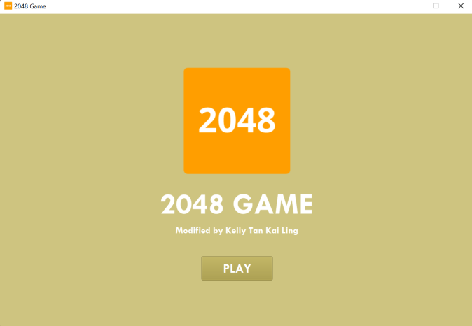
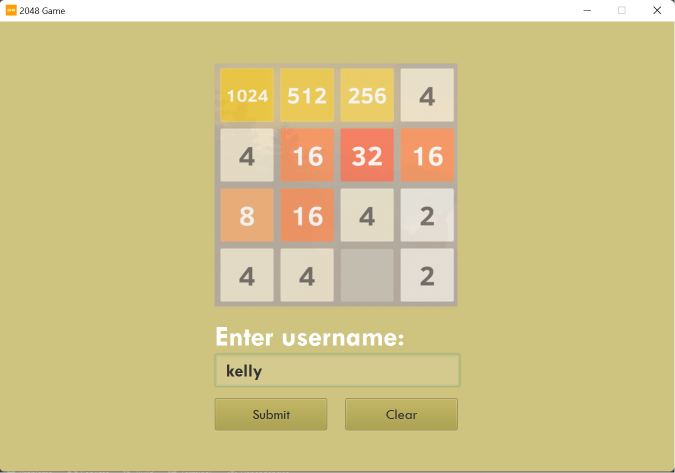
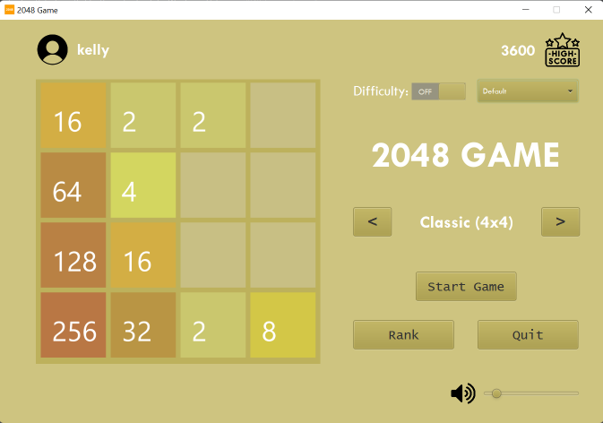
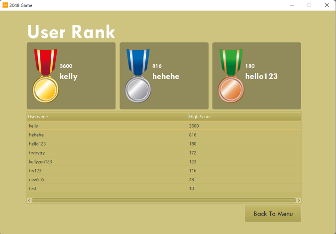
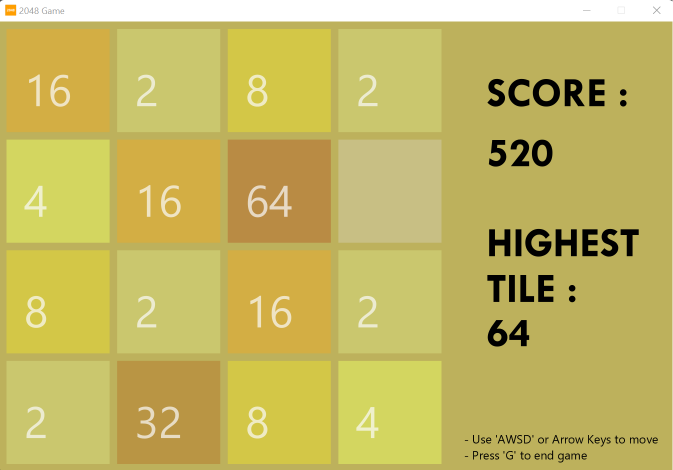
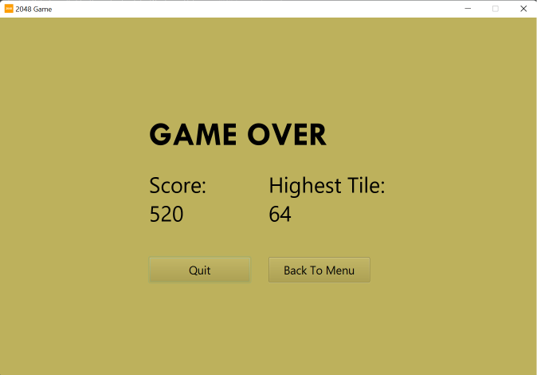

>Kelly Tan Kai Ling (20310184)
# 2048 Game
## COMPILATION
### Installing Java IDE
1. Download [IntelliJ](https://www.jetbrains.com/idea/download/), [Eclipse](https://www.eclipse.org/downloads/), [Netbeans](https://netbeans.apache.org/download/index.html) or any preferred IDE of your choice.
2. Install the Java IDE using the downloaded installer along with JDK and direct the installation to your preferred path.
### Downloading files
3. Download _ALL_ the files and place it in "IdeaProjects" folder.
### Run 2048 Game
4. Run GameApp.java ``/src/main/java/com/example/game/GameApp.java``

## FEATURES
### Launch

- [x] Click "PLAY" button to start game
### Login

- [x] Enter username in textbox
- [x] "Clear" button to clear texts in textbox
- [x] "Submit" button to proceed to Menu
### Menu

- [x] Theme dropdown to change game theme colour (Dark, Light, Fantasy, Nymph, Default)
- [x] Difficulty toggle switch to on/off difficulty level
- [x] "<" or ">" button to change game mode (3x3, 4x4, 5x5, 6x6)
- [x] "Start Game" button to proceed to game
- [x] "Rank" button to view podium and rank table
- [x] "Quit" button to quit game
- [x] Slider to adjust bgm volume
- [ ] "Next" button to change bgm (not yet implement)
### Rank

- [x] Displays top 3 podium
- [x] Displays rank table
- [x] "Back To Menu" button to proceed to Menu
### Game

- [x] Click AWSD or up/down/left/right key to move cells
- [x] Click 'G' key to end game
- [x] Displays high score and highest tile achieved
### End Game

- [x] Displays high score and highest tile achieved
- [x] "Quit" button to quit game
- [x] "Back To Menu" button to proceed to Menu
- [ ] "Replay" button to replay game (not yet implement)

## MAINTENANCE PERFORMED
### Corrective maintenance:
- Fixed incorrect score calculation
- Fixed cell spawning on any key pressed
### Preventive maintenance:
- Split classes to individual packages based on similar functionality
    - 'scene' package to store all scenes (launch, login, menu, rank, game, endGame)
    - 'theme' package to store all themes
    - 'components' package to store button, text, dialog, and toggle switch
    - 'audio' package to store bgm
- Break large classes to individual class/method 
    - extract haveEmptyCell(), haveSameNumberNearly(), canNotMove() from GameScene to new GameState class
- Apply design principle
    - abstract factory pattern for move package by calling MoveUp/MoveDown/MoveLeft/MoveRight class through MoveFactory class
    - adaptor pattern for resource package to direct to different resource path using only filename and filetpye
### Perfective maintenance:
- Added new features (rank, bgm, theme colour, game mode & difficulty)
- Added game logo and title

## PROGRAM'S STRUCTURE 
```src/main/java/com/example/game```
### New Java Classes & Packages
#### ``/audio``
- MediaPlayer (interface)
- AudioPlayer (class)
***
#### ``/components/buttonComponent``
- ButtonComponent (class)
#### ``/components/dialogComponent``
- DialogComponent (interface)
- ConfirmationDialog (class)
- WarningDialog (class)
- CongratulationDialog (class)
- QuitDialog (class)
#### ``/components/textComponent``
- TextComponent (class)
#### ``/components/toggleSwitchComponent``
- ToggleSwitchComponent (class)
***
#### ``/resource``
- Resource (interface)
- ResourcePath (abstract)
- ResourceDirectory (class)
#### ``/resource/directory``
- ResourceBgm (class)
- ResourceDocuments (class)
- ResourceGUI (class)
- ResourceImages (class)
- ResourceStyling (class)
***
#### ``/scene/account``
- AccountController (class)
- FileHandler (class)
- Username (class)
#### ``/scene/game``
- IGameDifficulty (interface)
- IGameMode (interface)
- GameDifficulty (class)
- GameMode (class)
- GameState (class)
#### ``/scene/game/cell``
- NewCell (interface)
- CreateRandomCell (class)
#### ``/scene/game/move``
- Movable (interface)
- Movement (class)
- MoveFactory (class)
- MoveUp (class)
- MoveDown (class)
- MoveLeft (class)
- MoveRight (class)
- ValidDestination (class)
#### ``/scene/launch``
- LaunchController (class)
#### ``/scene/menu``
- Menu (class)
- MenuController (class)
#### ``/scene/rank``
- Rank (class)
- RankController (class)
***
#### ``/theme``
- ITheme (interface)
- IBackgroundScene (interface)
- Theme (class)
- BackgroundScene (class)

### Modified Java Classes & Packages
- GameApp (class)
#### ``/scene/account``
- Account (class)
#### ``/scene/endGame``
- EndGame (class)
#### ``/scene/game``
- GameScene (class)
#### ``/scene/game/cell``
- Cell (class)
- TextMaker (class)

## UNIT TEST
```/Test/com/example/game/account```
- UsernameTest

## JAVADOC
```/javadoc/index.html```

## REFERENCES
- [Theme styling](https://gist.github.com/genmancoder/146bad2111bfabed1b04d894926c83d8)
- [Toggle switch button](https://gist.github.com/TheItachiUchiha/12e40a6f3af6e1eb6f75)
